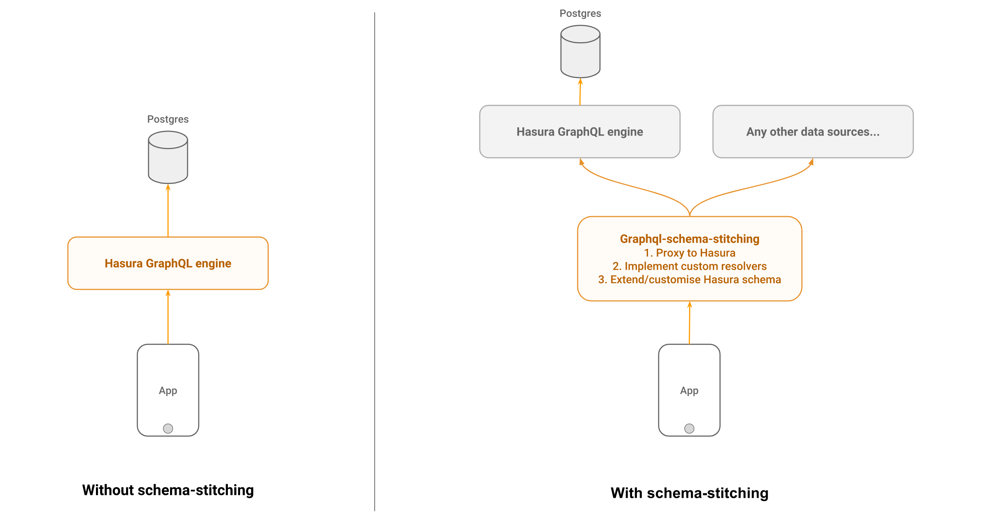

# graphql-schema-stitching-example

This is a boilerplate reference for setting up a GraphQL schema-stitching server.
It is ideal to customise the default Hasura schema or add custom resolvers and uses
[graphql-tools](https://github.com/apollographql/graphql-tools) and [apollo-server](https://github.com/apollographql/apollo-server).



## Usage
To run, run the following commands:

```
git clone https://github.com/wawhal/graphql-schema-stitching-example
cd graphql-schema-stitching-example
npm install && npm start
```

Navigate to http://localhost:4000/graphiql to try out the APIs on GraphiQL.

The underlying Hasura GraphQL engine that is used and stitched in this example is at:
https://bazookaand.herokuapp.com

## Code structure

1. `server.js` is the entrypoint which stitches together the hasura schema and a custom schema
2. `hasuraSchema.js` defines the Hasura schema using an endpoint of a running Hasura GraphQL engine
2. `customSchema.js` defines a custom type and a custom resolver

## Adding your own resolvers

1. To add your own resolvers, edit `customSchema.js`
2. Define your own GraphQL type and add a resolver function
3. In the resolver function, call an HTTP endpoint, write your own business logic etc.

## Other use-cases

We are adding more examples to this repo to cover the following use-cases when used along with Hasura GraphQL engine:
*Work In progress*
1. Overriding queries/mutations generated by Hasura GraphQL engine
2. Extending the schema or types generated by Hasura
3. Schema transforms for renaming fields generated by Hasura

## Running with Docker / Kubernetes

- Build and test with docker by running `./docker-run.sh`
- This creates an image called: `gql-schema-stitching:test`
- Deploy on kubernetes with `kubectl create -f k8s.yaml`. The kubernetes deployment expects this image to be present: `gql-schema-stitching:test`
- Test on kubernetes by running `kubectl proxy` and then opening: `http://localhost:8001/api/v1/namespaces/default/services/gql-schema-stitching/proxy`. In the URL bar on GraphQL playground, remember to change the current URL to the above.
